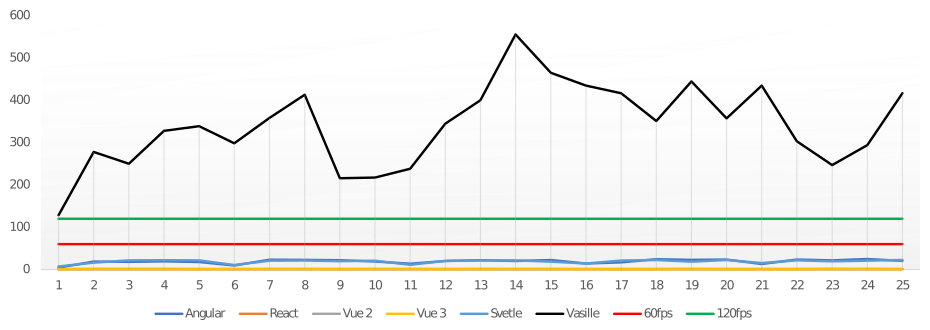

# Vasille.js

|Intro|
|:---:|
||
|Vasille.js is **very fast** javascript frontend framework, it is not using virtual DOM, it updates DOM directly using an own reactive mechanism.|

This framework is in active development, if you want to contribute contact
the maintainer: Lelițac Vasile (lixcode@vivaldi.net).

### Table of content
[[_TOC_]]

## Project roadmap

| Feature                                     | Deadline     | Status     |
|---------------------------------------------|--------------|------------|
| Initial Version                             | 01.07.2021   | Ready      |
| Patch to 1.1                                | 02.12.2021   | Ready      |
| Describe API                                | 02.14.2021   | Ready      |
| Describe JS API                             | 02.15.2021   | Ready      |
| Describe VCC architecture                   | 02.22.2021   | Waiting    |
| Code and debug VCC                          | 03.xx.2021   |            |
| First enterprise ready version              | xx.xx.2021   |            |
| Boost by HTML templates                     | xx.xx.2021   |            |

## API documentation

Currently, the [API](pages/API.md) is in development, 
but the [JavaScript API](pages/JavaScriptAPI.md)
is available.

* [API Documentation](https://gitlab.com/vasille-js/vasille-js/-/blob/master/pages/API.md)
* [JS API Documentation](https://gitlab.com/vasille-js/vasille-js/-/blob/master/pages/JavaScriptAPI.md)

## Tools in development

* **Vasille.js** is a component based framework without any dependencies
* **Reactive Reference** is a build in reactivity library of Vasille.js
* **Vasille Language** is a user-friendy language to describe Vasille.js 
  components
* **VCC** (*Vasille Component Compiler*) translate code from Vasille 
  language to high-effective Vasille.js components performing a 
  lot of performance improvements.
  
## How it works

To test the speed of frameworks (inclusive Vasille JS) I had created a map, 
which can be zoomed up to 32x, this project was called "Project x32".

On the next image is demonstrated the difference between 1x zoom (on the 
left side) and x32 zoom (on the right side):

There are 100 random squares over each brick, on small zoom the squares 
are hidden to optimize browser performance, because the page is composed 
of over than 23 000 nodes. The random squares added one by one to not 
freeze zoom animation. The zoom animation duration is 300ms, and it 
must consist of 20 frames on 60Hz screen.

The project x32 was coded using the next frameworks:
* Angular.
* React.
* Vue 2.
* Vue 3.
* Svelte.
* Vasille JS.

### Measuring zoom performance

After zooming in each production build and measuring performance 
I had got the next results:

The Vue & React builds are the slowest: the average frame time of:
* React build is 1263.48ms.
* Vue 3 build is 971.80ms.
* Vue 2 build is 823.56ms.

There is the same graphic in logarithmic scale:

Let's analyze the Angular, Svelte & Vasille JS results:
* Angular & Svelte has a similar result, the average time of frame 
  is 53.94ms for Angular & 53.98 for Svelte.
* The Vasille JS is the unique framework which support the zoom 
  animation at 60fps without any additional optimization.  
  Average time of frame is 3.22ms.

#### Try it:
* [Project x32 powered by Angular](https://vasille-js.gitlab.io/project-x32/angular/)
* [Project x32 powered by React](https://vasille-js.gitlab.io/project-x32/react/)
* [Project x32 powered by Vue 2](https://vasille-js.gitlab.io/project-x32/vue-2/)
* [Project x32 powered by Vue 3](https://vasille-js.gitlab.io/project-x32/vue-3/)
* [Project x32 powered by Svelte](https://vasille-js.gitlab.io/project-x32/svelte/)
* [Project x32 powered by Vasille JS](https://vasille-js.gitlab.io/project-x32/vasille-js/)

### Let's optimize Project x32

To optimize the Project x32 realizations, the optimization consist 
of removing the off-screen components, that change will decrease 
the number of components. So let's zoom each optimized build 
from x1 to x32.

Tests results:

After X8 the number of onscreen components is very small, the optimization has a good result.
The Reactive frameworks are the slowest before and after optimization.

There is the same graphic in logarithmic scale:

After optimization Angular, Svelte & Vasille JS has very good 
results close to Vasille JS before optimization.

#### Try it:
* [Optimized Project x32 powered by Angular](https://vasille-js.gitlab.io/project-x32-if/angular/)
* [Optimized Project x32 powered by React](https://vasille-js.gitlab.io/project-x32-if/react/)
* [Optimized Project x32 powered by Vue 2](https://vasille-js.gitlab.io/project-x32-if/vue-2/)
* [Optimized Project x32 powered by Vue 3](https://vasille-js.gitlab.io/project-x32-if/vue-3/)
* [Optimized Project x32 powered by Svelte](https://vasille-js.gitlab.io/project-x32-if/svelte/)
* [Optimized Project x32 powered by Vasille JS](https://vasille-js.gitlab.io/project-x32-if/vasille-js/)

## Conclusions
The main goal of Vasille JS is not to be the fastest JavaScript framework, 
but to ensure excellent performance without any optimizations.

## Questions

If you have questions, fell free to contact the maintainer of project:

* [Author's Email](mailto:lixcode@vivaldi.net)
* [Project Discord Server](https://discord.gg/SNcXNZxz)
* [Author's Telegram](https://t.me/lixcode)
* [Author's VK](https://vk.com/lixcode)

